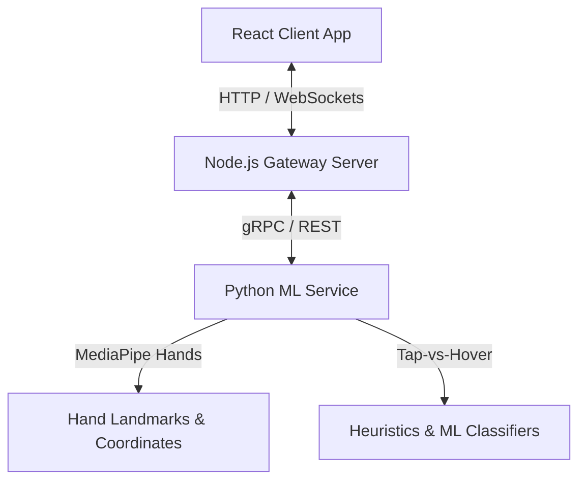

# AirType: AI-Powered Virtual Keyboard System

AirType is a virtual keyboard system that enables users to type by tapping their fingertips in mid-air over an on-screen keyboard layout. The system tracks finger movements in real time using a standard laptop webcam — requiring no physical hardware.

---

## Architecture Overview

AirType is designed as a modular distributed application:
1. **`client` (React / TypeScript)**: Renders the virtual keyboard overlay, displays the webcam feed, overlays tracked hand landmarks, and shows typed text.
2. **`server` (Node.js / Express)**: Acts as the gateway layer. It manages user sessions, typing history, and proxies coordinates between the client web application and the Python machine learning service.
3. **`ml-service` (Python)**: Processes video frame coordinates using MediaPipe Hands, runs tap-vs-hover gesture classification models, and drives the typing state machine.



---

## Directory Structure

```
airtype/
├── .github/                        # GitHub specific templates and configuration
├── client/                         # Core Frontend Application (React, HTML, CSS, TypeScript)
├── server/                         # Gateway Layer (Node.js, Express, Session management)
├── ml-service/                     # Python ML Microservice (MediaPipe, Tap classification)
├── data/                           # Dataset Management (Raw recordings & processed formats)
├── models/                         # Serialized Model Files (Weights & model registry)
├── experiments/                    # ML Experiments (Pinch vs. Dwell vs. Depth prototypes)
├── benchmarks/                     # Performance verification (Latency, accuracy reports)
├── docs/                           # Documentation and Architectural Decision Records (ADRs)
├── assets/                         # Graphic layouts, Mockups, and Media
├── tools/                          # Developer utilities and dataset collection applications
├── scripts/                        # Automation & orchestrations (setup, run scripts)
├── config/                         # Unified application configurations
└── logs/                           # Runtime local debug logs
```

### Directory Details

| Folder | Purpose | What belongs here | What does NOT belong here |
| :--- | :--- | :--- | :--- |
| [`client/`](file:///client/) | Renders keyboard UI and webcam stream. | React code, TSX components, style sheets, client tests. | Model binaries, Python scripts, database credentials. |
| [`server/`](file:///server/) | API gateway, auth, session/history storage. | Express routes, proxy services, session models. | Raw datasets, frontend views, Python trackers. |
| [`ml-service/`](file:///ml-service/) | Real-time hand coordinate processing & state engine. | MediaPipe wrappers, FastAPI endpoints, classification rules. | DB credentials, React components, raw videos. |
| [`data/`](file:///data/) | Dataset and gesture session storage. | Raw user webcam recordings, labeled landmark datasets. | ML model binaries, application code, test logs. |
| [`models/`](file:///models/) | Production model storage. | Model weight files (onnx, pkl, tflite), model version registry. | Training notebooks, code dependencies, raw dataset files. |
| [`experiments/`](file:///experiments/) | Sandbox for ML prototyping. | Jupyter notebooks, tap-detection heuristic scratchpads. | Core production endpoints, core routing systems. |
| [`benchmarks/`](file:///benchmarks/) | Quantitative verification scripts. | Performance suites, latency tests, accuracy validation reports. | UI styles, client rendering code. |
| [`docs/`](file:///docs/) | Project design and decision records. | Architectural Decision Records (ADRs), system design specs. | Runtime log files, large binary mockups, system source code. |
| [`assets/`](file:///assets/) | Creative files and layout vectors. | Keyboard layouts (SVG/JSON), Figma outputs, screen captures. | Production ML models, data recordings. |
| [`tools/`](file:///tools/) | Developer workflow accelerators. | Custom coordinate logging scripts, data collection GUIs. | Production client code, main backend endpoints. |
| [`scripts/`](file:///scripts/) | Global utility scripts. | Setup scripts, service run triggers, dataset sync helpers. | System configurations, importable JS/Python modules. |
| [`config/`](file:///config/) | Global parameters. | Keyboard coordinate offsets, default physical limits, env templates. | API credentials, secrets, actual `.env` files. |
| [`logs/`](file:///logs/) | Debug traces. | App run logs, classification pipeline output logs. | Production database configs, persistent code. |

---

## Current Progress

- **[x] Lesson 1: Computer Vision Basics**: Completed foundations covering coordinate grids, BGR-vs-RGB representations, and ecosystem libraries.
- **[x] Lesson 2: Camera Pipeline Foundation**: Implemented a modular, context-managed `CameraManager` and execution loop to stream real-time webcam video frames.
- **[x] Lesson 3: MediaPipe Hand Tracking**: Integrated Google MediaPipe Hands tracking to extract 21 3D coordinates and overlay them onto the video feed in real time.
- **[x] Lesson 4: Fingertip Tracking & Coordinate Mapping**: Extracted index fingertip coordinates, implemented normalized-to-pixel space conversions, and added tracking visual pointers.
- **[x] Lesson 5: Motion Smoothing (EMA)**: Implemented a reusable coordinate filtering interface, added an Exponential Moving Average filter, and added lag vectors comparison overlays.
- **[x] Lesson 6: Virtual Keyboard Rendering**: Modelled QWERTY layouts and implemented a translucent visual keyboard overlay on the bottom half of the capture stream.
- **[x] Lesson 7: Hover Detection Using Bounding Box Collision**: Created point-in-rectangle collision hitboxes and added dynamic key highlighted visual feedback overlays.
- **Next Milestone**: Pinch-to-Tap Gesture Detection & Heuristics (`Lesson 8`).

---

## Getting Started

### Prerequisites
- Node.js (v18.x or v20.x)
- Python (v3.10 or v3.11)
- Git (LFS enabled for model/dataset storage)

### Installation
Run the setup script corresponding to your operating system to install dependencies across the client, server, and ML services:

- **Linux/macOS:**
  ```bash
  ./scripts/setup.sh
  ```
- **Windows (PowerShell):**
  ```powershell
  .\scripts\setup.ps1
  ```

### Running the Services
Start all microservices in local development mode using:
```bash
./scripts/run_dev.sh
```

---

## Architectural Decision Records (ADRs)
We use ADRs to track key design decisions and constraints. You can find them under [`docs/adrs/`](file:///docs/adrs/):
- **[ADR-0001: Record Architecture Decisions](file:///docs/adrs/0001-record-architecture-decisions.md)**
- **[ADR-0002: Tap Detection Method](file:///docs/adrs/0002-tap-detection-method.md)**
- **[ADR-0003: MediaPipe Hands Tracking](file:///docs/adrs/0003-mediapipe-tracking.md)**
- **[ADR-0004: Gateway Layer vs. Direct Python Backend](file:///docs/adrs/0004-gateway-vs-direct-backend.md)**

---

## License
This project is licensed under the MIT License - see the [LICENSE](file:///LICENSE) file for details.